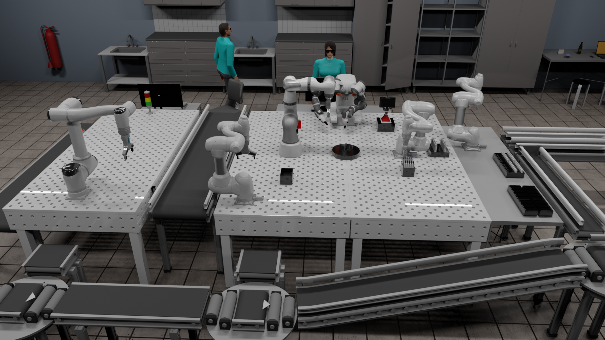

### Programming for robots and manipulators

**Course aims:** The goal of the subject Programming of robots and manipulators is to introduce students to modern approaches to robotic technology with focus on programming including solving kinematics/dynamics, optimization of movement, Industry 4.0 and utilization of artificial intelligence. Lecturer of this course (2021): [Ing. Roman Parak](https://github.com/rparak).

* Presentation - Presentation about collaborative robotics, ROS and some interesting points [[czech lang.]](https://en.wikipedia.org/wiki/Czech_language). 
* Seminar_paper - Seminar paper, which describe problematic of robots for medicine [czech lang.].
* Project_1 - **ABB RobotStudio - Sorting production line**   This project contain [ABB Robotstudio](https://new.abb.com/products/robotics/en/robotstudio) pack-go file with programed robotic sorting production line in pro. lang. RAPID. Project contain 2 robots in defined template from lecturer with small configurations. The main goal of project was to program functional product sorting machine. According to project assigned, robots use for communication conveyor.

https://user-images.githubusercontent.com/54715463/119114859-d3363200-ba26-11eb-908f-33b9a072e214.mp4

* Project_2 - **Visual Components - Test laboratory cell**  This semestral team project is focused on simulation test laboratory cell. In this folder you can find [Visual Components](https://www.visualcomponents.com) .vcmx file, with presenation of work [czech lang.]. Project is programmed in python and simple VC programming interface. 

* Project_3(self paced) - coming soon RoboDK 

#### References
* [rparak Programming for robots and manipulators (VRM)](https://github.com/rparak/Programming-for-robots-and-manipulators-VRM)
* [IACS FME BUT Programming for robots and manipulators](https://www.fme.vutbr.cz/en/studenti/predmety/233662)
